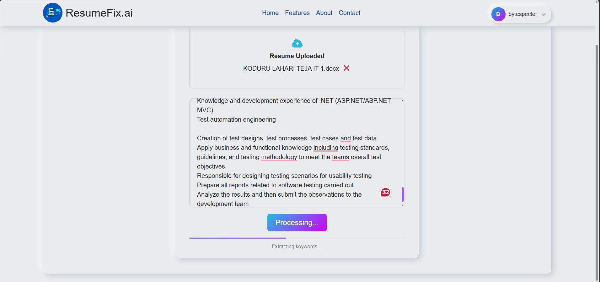
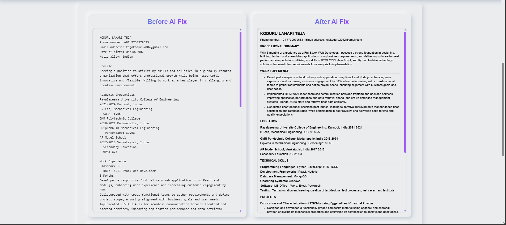
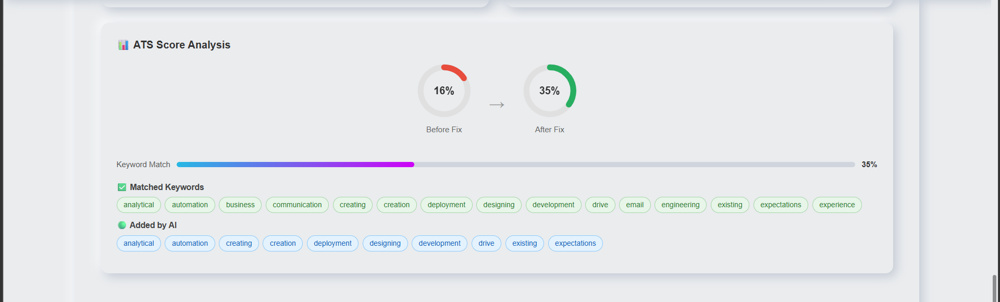
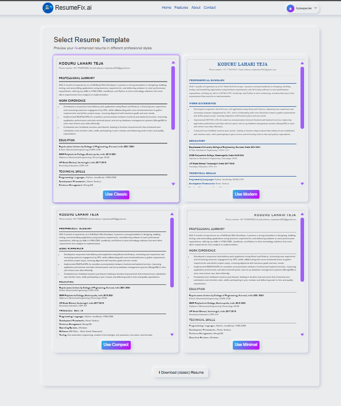
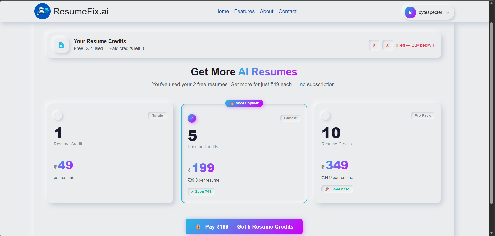

# ResumeFix.ai 🤖

> AI-Powered Resume Optimizer that helps job seekers beat ATS systems and land more interviews.


---

## 🚀 What is ResumeFix.ai?

ResumeFix.ai is a full-stack web application that analyzes your resume against a job description, optimizes the content using **Groq AI**, and generates a professional ATS-friendly PDF resume — all in seconds.

Built as a **solo project** with real-world monetization, authentication, and AI integration.

---

## ✨ Features

- 🧠 **AI Resume Optimization** — Groq AI rewrites your resume to match the job description
- 📊 **ATS Keyword Scoring** — Before/after keyword match score with matched & missing keywords
- 🎨 **4 Resume Templates** — Classic, Modern, Compact, Minimal
- 📄 **PDF Generation** — Download professional resumes using ReportLab
- 🔐 **Dual Authentication** — Email/Password (with email verification) + Google OAuth 2.0
- 💳 **Credit-Based Payments** — 2 free downloads, buy more via custom Razorpay UI
- ✉️ **Cover Letter Generator** — AI-generated cover letters based on your resume + JD
- 📱 **Fully Responsive** — Neumorphic UI works across all devices

---

## 🛠 Tech Stack

| Layer | Technology |
|-------|-----------|
| Backend | Python, Django 6.0 |
| Frontend | JavaScript (Vanilla), HTML5, CSS3, Bootstrap |
| Database | SQLite (dev) |
| AI | Groq AI API (LLaMA 3) |
| Auth | Django Allauth, Google OAuth 2.0 |
| Payments | Razorpay (custom UI, no SDK) |
| PDF | ReportLab |
| Version Control | Git, GitHub |

---

## 📸 Screenshots

### 🏠 Upload Page
> Upload your resume (PDF/DOCX) and paste the job description



### ✏️ Before & After Resume
> Original vs AI-optimized resume content comparison



### 📊 ATS Score & Results
> AI optimized resume with keyword match analysis



### 🎨 Template Selection
> Choose from 4 professional resume templates



### 💳 Payment Page
> Credit-based system with clean checkout UI



---

## ⚙️ Local Setup

```bash
# 1. Clone the repo
git clone https://github.com/TejaKoduru-0329/resumefix.git
cd resumefix

# 2. Create virtual environment
python -m venv venv
venv\Scripts\activate  # Windows
source venv/bin/activate  # Mac/Linux

# 3. Install dependencies
pip install -r requirements.txt

# 4. Create .env file
cp .env.example .env
# Add your API keys (see below)

# 5. Run migrations
python manage.py migrate

# 6. Start server
python manage.py runserver
```

---

## 🔑 Environment Variables

Create a `.env` file in the root directory:

```env
GROQ_API_KEY=your_groq_api_key
EMAIL_HOST_USER=your_gmail
EMAIL_HOST_PASSWORD=your_app_password
RAZORPAY_KEY_ID=rzp_test_xxxx
RAZORPAY_KEY_SECRET=your_secret
```

---

## 💡 Key Implementation Highlights

- **Credit System** — DB-based credits persist across login/logout. 2 free downloads per user, additional credits purchased via Razorpay
- **Custom Razorpay UI** — Built payment modal from scratch without Razorpay SDK
- **ATS Scoring Algorithm** — Custom keyword extraction with stop-word filtering compares resume vs job description
- **Dual Auth Flow** — Native email/password with email verification + Google OAuth 2.0 via Django Allauth
- **PDF Templates** — 4 distinct resume styles generated dynamically using ReportLab

---

## 📁 Project Structure

```
resumefix/
├── core/                   # Main app (upload, fix, download)
│   ├── templates/core/     # HTML templates
│   ├── static/core/        # CSS, JS, images
│   ├── views.py            # All core views
│   ├── models.py           # ResumeAnalysis model
│   └── utils.py            # AI, PDF, text extraction
├── payments/               # Payments app
│   ├── templates/payments/ # Checkout template
│   ├── models.py           # UserPlan, Payment models
│   ├── views.py            # Payment views
│   └── urls.py             # Payment URLs
├── resumefix_project/      # Django project settings
├── screenshots/            # README screenshots  ← ఇది add చేయి
├── media/generated/        # Generated PDFs
├── .env                    # Environment variables
└── manage.py
```

---

## 🗺 Roadmap

- [x] AI Resume Optimization (Groq AI)
- [x] ATS Keyword Scoring System
- [x] Google OAuth + Email Authentication
- [x] Email Verification
- [x] Credit-based Payment System (Razorpay)
- [x] 4 Resume Templates + PDF Generation
- [x] Cover Letter Generator
- [ ] Deploy to production
- [ ] Razorpay Live mode
- [ ] Resume score history dashboard
- [ ] Multiple resume versions per user

---

## 👨‍💻 Author

**Koduru Lahari Teja**  
Full Stack Developer | Python • Django • JavaScript  
📧 koduruteja410@gmail.com  
🔗 [LinkedIn URL](https://www.linkedin.com/in/lahariteja) 
🐙 [GitHub](https://github.com/TejaKoduru-0329)

### 🛠 Skills
`Python` `Django` `JavaScript` `HTML5` `CSS3`  
`SQLite` `REST APIs` `Git` `GitHub`  
`Google OAuth` `Razorpay` `Groq AI` `Bootstrap`

---

## 📄 License

This project is open source and available under the [MIT License](LICENSE).  
Built for portfolio purposes — feel free to explore the code!